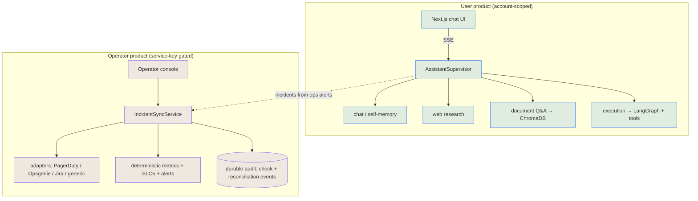

# AIRA-X

[](https://github.com/catonlsd/AIRA-agent/actions/workflows/fast-check.yml)
[](https://github.com/catonlsd/AIRA-agent/actions/workflows/e2e.yml)
[](https://github.com/catonlsd/AIRA-agent/actions/workflows/docs.yml)
[](LICENSE)

**AIRA-X is two production-grade surfaces behind one codebase:**

1. **A conversational AI assistant** — one supervisor orchestrates chat, web research,
   document Q&A, and safe task execution behind a single streaming API and a Next.js UI.
2. **An operator-grade incident-sync & observability platform** — a service-key-gated
   operator console that exports incidents to external tools (PagerDuty / Opsgenie /
   Jira / generic webhooks), validates and continuously re-checks each integration,
   reconciles drift through **deliberate, audited** recovery actions, and surfaces a
   **deterministic** SLO/trend dashboard with candidate alerts.

The first surface is the product. The second is what makes AIRA-X interesting to a staff
engineer or CTO: it treats integrations the way a real platform team does — capability
honesty, explicit policy, durable audit, computed-not-stored readiness, and a hard rule
that **external systems never silently become the source of truth.**

> **Want to see it in 3 minutes?** Run it locally, open the operator console, and click
> **Seed demo data** — or follow **[docs/DEMO_WALKTHROUGH.md](docs/DEMO_WALKTHROUGH.md)**.

| | |
|---|---|
| **Backend tests** | **931** passing (70 files), deterministic (`pytest -p no:randomly`) |
| **Frontend** | **104** pure-logic lib tests + **6** deterministic Playwright E2E |
| **Incident adapters** | 4 (generic, PagerDuty, Opsgenie, Jira) · 5 onboarding profiles |
| **Readiness model** | 8 computed states, never stored stale |
| **Operator surface** | 68 gated endpoints; zero operator capability leaks into the user product |

Full numbers: **[docs/PLATFORM_SUMMARY.md](docs/PLATFORM_SUMMARY.md)**.

---

## Why AIRA-X exists

Most "AI assistant" projects stop at the happy path: a chat box that streams tokens.
AIRA-X was built to answer the *next* questions a production reviewer asks — *who can
operate it, how do failures surface, how is recovery performed, and how do you prove any
of it?* The incident-sync subsystem is a deliberate, end-to-end demonstration of
operating an integration safely: honest capabilities, explicit policy, durable audit,
and bounded, deterministic observability. Nothing auto-heals; everything is explainable.

---

## Table of contents

- [Architecture summary](#architecture-summary)
- [Feature matrix](#feature-matrix)
- [Screenshots](#screenshots)
- [Operator console](#operator-console)
- [Incident sync](#incident-sync)
- [Observability](#observability)
- [Demo mode](#demo-mode)
- [Quickstart (local)](#quickstart-local)
- [Local development](#local-development)
- [Production deployment](#production-deployment)
- [Testing](#testing)
- [Architecture principles](#architecture-principles)
- [Roadmap](#roadmap)
- [Documentation map](#documentation-map)

---

## Architecture summary

Two surfaces, one FastAPI app + one Next.js app, sharing a self-healing SQLite/Postgres
schema. The **user product** (chat) and the **operator product** (incident sync +
observability) are separated by a hard auth boundary: the operator surface requires the
service key and **never** appears in user-facing responses.



Deep dive — boundaries, request/sync/operator/observability flows, trust & security
model, deployment topology — in **[docs/ARCHITECTURE.md](docs/ARCHITECTURE.md)**.

---

## Feature matrix

### User product (conversational assistant)
| Capability | What it does | Notes |
|---|---|---|
| Unified supervisor | One `AssistantSupervisor` classifies + routes every turn | research/execution are *capabilities*, not separate apps |
| Streaming chat | Token-by-token SSE | reconnect-safe |
| Document Q&A | Upload PDF/DOCX/TXT/MD → grounded answers + citations | ChromaDB + local embeddings; honest "not in your files" |
| Web research | Source-grounded answers for current info | |
| Safe execution | file/git/shell/python tools with approval gating | plan → approve → execute |
| Accounts & scope | account-first ownership, workspaces, roles, preferences | no cross-owner leakage |
| Tracing | every turn persisted (route, latency, sources, status) | JSONL, rotated |

### Operator product (incident sync & operations)
| Capability | What it does | Guarantee |
|---|---|---|
| Incident export | Outbound sync of incident transitions to external tools | local state stays primary |
| Adapters | generic, PagerDuty, Opsgenie (rich), Jira (outbound-only) | honest capability model — no fake vendor claims |
| Profiles | 5 onboarding presets set *defaults only* | capability is the ceiling |
| Readiness | preflight `validate` + safe synthetic `test` → 8 computed states | never stored stale; ages to `stale` |
| Secret hygiene | rotation invalidates trust; secrets never returned | `has_secret` only |
| Drift detection | bounded inbound *re-check* (never a mutation) | external never overwrites local |
| Recovery | refresh / apply / relink / detach / redrive | **explicit, audited, operator-initiated** |
| Audit | durable check + reconciliation event trails | secret-free, summarized for discoverability |
| Observability | readiness distribution, 24h/7d/30d SLO trends, drift backlog, candidate alerts | **deterministic, computed on read** |
| Operational guidance | per-state `recommended_action` + 12 runbooks + troubleshooting matrix | deterministic, never AI advice |
| Demo mode | one-click deterministic showcase + guided tour | namespaced; never touches real data |

---

## Screenshots

> Add captures to `docs/screenshots/` and replace the placeholders below. Suggested set
> (each is reachable in &lt;1 min after **Seed demo data**):

| View | Path | Shows |
|---|---|---|
| Operator console — readiness | `docs/screenshots/operator-readiness.png` | targets across every readiness state + recommended actions |
| Sync observability | `docs/screenshots/observability.png` | SLO tiles, 24h–30d trend pass rates, drift backlog, candidate alert |
| Drift recovery | `docs/screenshots/drift-recovery.png` | a drifted incident offering Refresh + Apply |
| Demo walkthrough | `docs/screenshots/demo-tour.png` | the seeded guided tour |
| Chat product | `docs/screenshots/chat.png` | streamed answer + artifact card |

---

## Operator console

A service-key-gated Next.js surface (`/operator`) for running the platform — **not** an
admin maze. It exposes exactly what an operator needs to *see, trust, and recover*:
delivery health, incident workflow (acknowledge / silence / assign / recover), the
incident-sync targets with their readiness + recommended next action, the observability
dashboard, and the demo controls. None of it is reachable without the operator key, and
none of it leaks into user-facing chat responses (proven by tests).

---

## Incident sync

Outbound-primary, capability-honest integration with external incident tools:

- **Local state is the source of truth.** Sync *exports* transitions; inbound `refresh`
  only *observes and records* external state — it **never** mutates the local incident.
- **Capability vs policy vs profile** are separate layers. An adapter's capabilities are
  the hard ceiling; a profile sets defaults; a per-target tri-state override can only
  *narrow* within capability. Every effective decision reports its `source`.
- **Readiness is computed, not stored.** A target is `unverified` until a preflight
  `validate` (config + connectivity) and a safe synthetic `test` (a no-op resolve through
  the real transport — touches no real incident) produce durable evidence. Evidence ages
  out to `stale`; a secret rotation invalidates it.
- **Drift is actionable, never auto-applied.** When external and local disagree, the
  operator chooses: `refresh`, `apply` (recover local from observed external — the only
  inbound→local action, explicit + audited), `relink`, or `detach`.

Runbooks, troubleshooting matrix, and recovery procedures: **[docs/PRODUCTION_READINESS.md](docs/PRODUCTION_READINESS.md)** §8–§10.

---

## Observability

A single operator endpoint (`GET /operator/incident-sync/metrics`) computes everything
**on read** from existing audit/history — no duplicate storage, no background
aggregation, no AI:

- **Readiness distribution** — count per state, fleet rollup.
- **Trend windows** — 24h / 7d / 30d pass rates for validation, reconciliation, refresh,
  apply, external-action, and sync. `null` (not a fake 0%/100%) when there's no data.
- **SLO signals** — target readiness %, validation pass %, reconciliation success %, sync
  success %. **Observed, never enforced.**
- **Candidate alerts** — deterministic threshold observations (repeated auth/validation
  failures, drift backlog, stale-readiness growth). **No notification, no paging** — they
  are observations the operator chooses to act on.

Glossary, SLI definitions, review checklist, and degradation guide:
**[docs/PRODUCTION_READINESS.md](docs/PRODUCTION_READINESS.md)** §11–§14.

---

## Demo mode

A fresh clone has an empty database, so the operator surface would otherwise be invisible.
One operator-gated call populates a **deterministic, namespaced** showcase that lights up
every capability at once:

```bash
# operator key configured as AIRA_API_KEY
curl -s -X POST localhost:8000/operator/demo/seed  -H "X-API-Key: $AIRA_API_KEY"
```
…or click **Seed demo data** in the operator console's Incidents tab, which renders a
guided tour inline. It seeds 6 targets across every readiness state, 5 incidents spanning
healthy / drifted / missing / stale, and audit history dated across all trend windows —
so the SLO dashboard and a live candidate alert appear immediately. Everything lives in
the `demo.aira-x.local` namespace; seed/reset touch **only** demo rows (a real target +
incident provably survive a reset). Disable in production with `DEMO_SEED_ENABLED=false`.

Step-by-step evaluation path: **[docs/DEMO_WALKTHROUGH.md](docs/DEMO_WALKTHROUGH.md)**.

---

## Quickstart (local)

**Prerequisites:** Python 3.12, Node 20+ (22 recommended), an LLM API key (Groq by default).

```bash
# 1) Backend
cd backend
python -m venv venv
# Windows: venv\Scripts\activate   |   macOS/Linux: source venv/bin/activate
pip install -r requirements.txt
cp .env.example .env          # fill GROQ_API_KEY; set API_KEY to enable the operator surface
python -m uvicorn app.main:app --reload --port 8000   # http://localhost:8000  (/health, /ready, /docs)

# 2) Frontend (new terminal)
cd frontend
npm install
npm run dev                   # http://localhost:3000   (operator console at /operator)
```

Then open `/operator`, enter the service key, and **Seed demo data**.

Or with Docker:
```bash
cp backend/.env.example backend/.env   # fill GROQ_API_KEY
docker compose up --build              # frontend :3000, backend :8000, data in the aira_storage volume
```

---

## Local development

- **Backend tests (deterministic):** `cd backend && python -m pytest -q -p no:randomly`
  — run in isolation (the test DB is shared SQLite; concurrent runs collide).
- **Frontend fast wall:** `cd frontend && ./node_modules/.bin/tsc --noEmit && node --test lib/*.test.mts && npm run lint && npm run build`
- **E2E (hermetic, Chromium):** `cd frontend && npm run e2e:install && npm run e2e`
  — fully API-mocked (no backend/LLM/DB needed); see `frontend/e2e/README.md`.

Environment reference: **[backend/.env.example](backend/.env.example)**. Key variables:

| Variable | Purpose | Default |
|---|---|---|
| `LLM_PROVIDER` / `GROQ_API_KEY` | LLM backend + key | `groq` / — |
| `DATABASE_URL` | SQLAlchemy URL (SQLite → Postgres is one env var) | local SQLite |
| `API_KEY` / `API_KEY_HEADER` | enable the operator surface (service-key auth) | unset (operator off) |
| `DEMO_SEED_ENABLED` | allow the operator demo seed | `true` |
| `RATE_LIMIT_PER_MINUTE` | per-client limit | `60` |
| `NEXT_PUBLIC_API_URL` (frontend) | backend URL for the browser | `http://localhost:8000` |

---

## Production deployment

- **Topology:** stateless **web** + thin **worker** against one shared DB; SQLite for
  local, **Postgres via a single env var** for production (schema self-heals on boot with
  idempotent `create_all` + additive column migrations).
- **Health:** `/health` (liveness), `/ready` (DB + LLM config readiness gate).
- **Operator gating:** set `API_KEY` to enforce the service-key boundary globally.
- **Hardening:** rate limiting, security headers, CORS, global JSON error handler (no
  stack-trace leaks), per-turn JSONL tracing.

Hosting recipes (Render / Railway / VPS / Docker / Kubernetes-readiness):
**[docs/DEPLOYMENT.md](docs/DEPLOYMENT.md)**. Persistence posture, secret hygiene,
backups, and the pre-deploy checklist: **[docs/PRODUCTION_READINESS.md](docs/PRODUCTION_READINESS.md)**.

---

## Testing

| Layer | Command | Count |
|---|---|---|
| Backend (deterministic) | `pytest -q -p no:randomly` | **931** |
| Frontend pure logic | `node --test lib/*.test.mts` | **104** |
| Browser E2E (hermetic) | `npm run e2e` | **6** |
| Type / lint / build | `tsc --noEmit` · `eslint` · `next build` | clean / 0 errors / compiles |

The suite is the proof, not the promise: readiness, drift, recovery, policy precedence,
audit, observability math, operator gating, and the demo seed are all pinned.

---

## Architecture principles

1. **Local state is the source of truth.** External systems are never allowed to silently
   become authoritative; inbound sync observes, it does not mutate.
2. **Recovery is explicit.** No auto-heal. Every state-changing recovery is an operator
   action with an audited trail and a stated blast radius.
3. **Capability ≠ policy ≠ profile.** Honesty about what an adapter *can* do, separated
   from what a target is *configured* to do.
4. **Explainable state only.** Readiness and metrics are computed from durable evidence;
   same inputs → same output. No black boxes, no AI advice in operations.
5. **Operator/user separation is a hard boundary.** Operator capability never leaks into
   the user product — and tests enforce it.
6. **Bounded everything.** Sweeps, metrics reads, and trend windows are capped — no
   unbounded fan-out to external systems or the database.

Rationale for each: **[docs/ENGINEERING_DECISIONS.md](docs/ENGINEERING_DECISIONS.md)**.

---

## Roadmap

Phases 1–7 are complete (production-readiness audit → lifecycle hardening → E2E →
runbooks → observability → demo mode → this portfolio packaging). Deliberately **out of
scope** (the platform is feature-complete for demonstration): more vendor adapters,
speculative AI features, and any auto-remediation. Natural next steps if taken to a real
deployment: Postgres-backed multi-replica run, encrypted secret column at rest, and a
notification channel layered *on top of* (never inside) the candidate-alert observations.

---

## Documentation map

| Doc | Purpose |
|---|---|
| **[docs/ARCHITECTURE.md](docs/ARCHITECTURE.md)** | System boundaries, flows, trust/security/audit model, Mermaid diagrams |
| **[docs/ENGINEERING_DECISIONS.md](docs/ENGINEERING_DECISIONS.md)** | Why the key choices were made |
| **[docs/DEMO_WALKTHROUGH.md](docs/DEMO_WALKTHROUGH.md)** | 5–10 min guided evaluation path |
| **[docs/PLATFORM_SUMMARY.md](docs/PLATFORM_SUMMARY.md)** | Resume-ready metrics + highlights |
| **[docs/OPERATIONS.md](docs/OPERATIONS.md)** | Full operational guide (every milestone) |
| **[docs/PRODUCTION_READINESS.md](docs/PRODUCTION_READINESS.md)** | Persistence, runbooks, SLIs, troubleshooting |
| **[docs/DEPLOYMENT.md](docs/DEPLOYMENT.md)** | Hosting recipes |
| **[docs/DEPLOYMENT_BLUEPRINT.md](docs/DEPLOYMENT_BLUEPRINT.md)** | Single-VM → compose → Kubernetes deployment tiers |
| **[docs/RELEASE_PROCESS.md](docs/RELEASE_PROCESS.md)** · **[CHANGELOG.md](CHANGELOG.md)** | Versioning, release/rollback, change history |
| **[docs/PORTFOLIO_GUIDE.md](docs/PORTFOLIO_GUIDE.md)** · **[docs/RESUME_BULLETS.md](docs/RESUME_BULLETS.md)** | Role-based reading orders, demo script, resume bullets |
| **[CONTRIBUTING.md](CONTRIBUTING.md)** · **[SECURITY.md](SECURITY.md)** · **[CODE_OF_CONDUCT.md](CODE_OF_CONDUCT.md)** | Contribution workflow, disclosure, conduct |
| **[HOW_TO_USE.md](HOW_TO_USE.md)** | User-product walkthrough |
