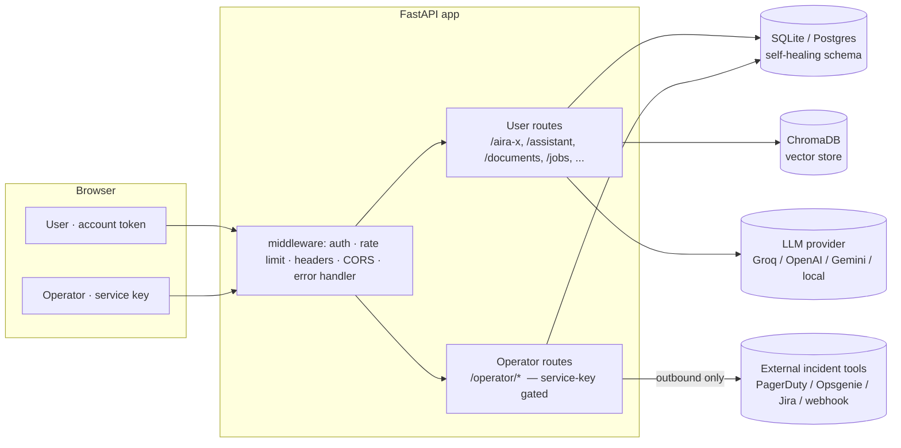
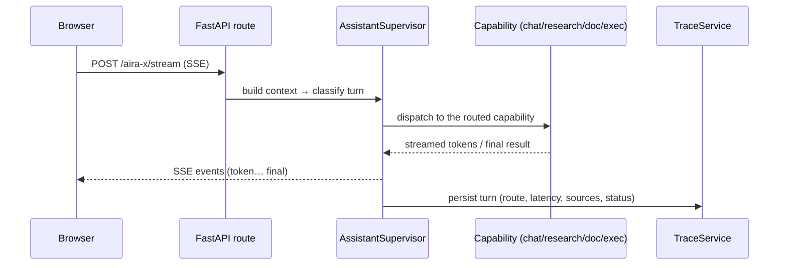
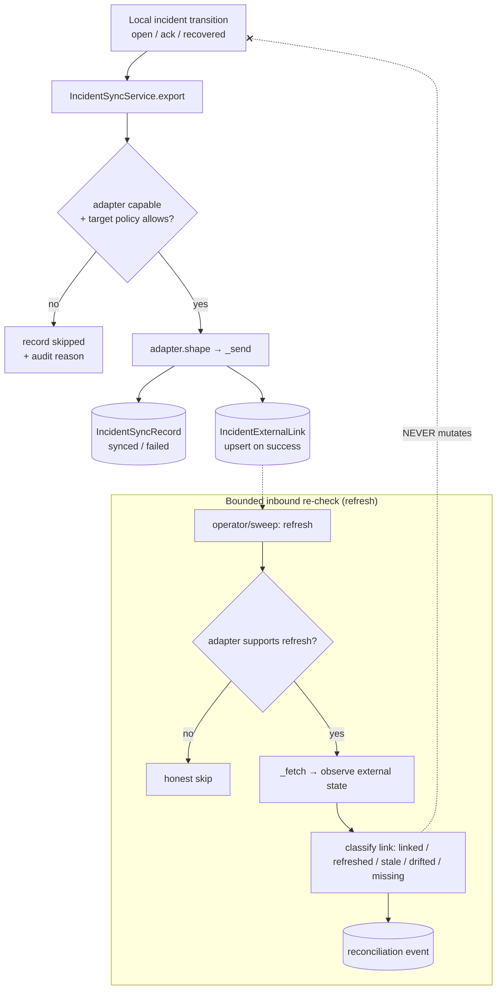
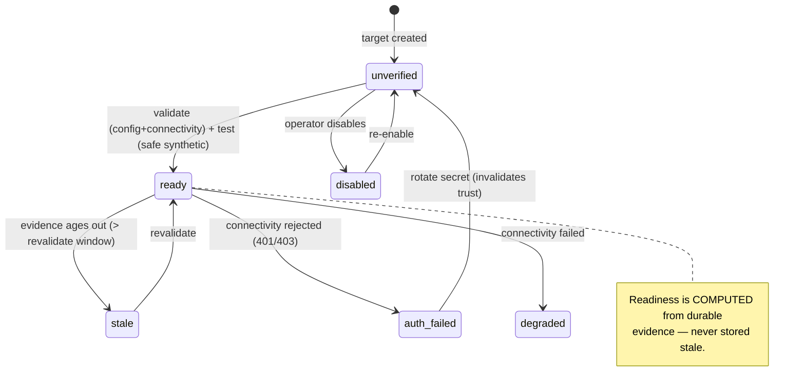
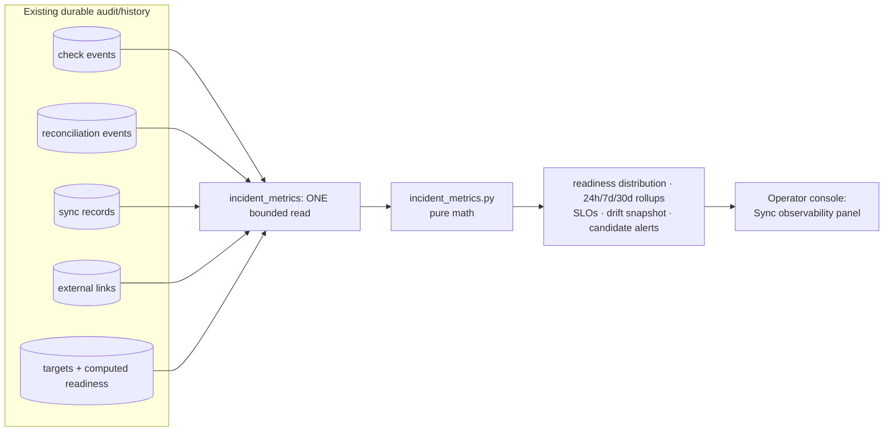
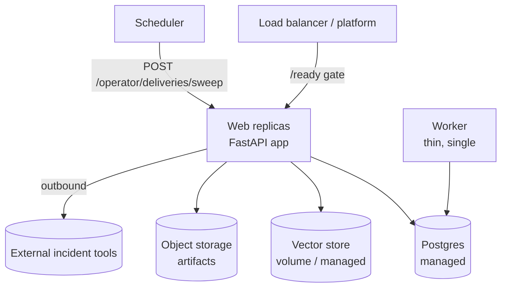

# AIRA-X — Architecture

This document maps the system the way a reviewer evaluates it: boundaries, components,
the flows that matter (request / sync / operator / observability), the deployment
topology, and the trust / security / audit models. Diagrams are Mermaid (rendered inline
by GitHub).

---

## 1. System boundaries

AIRA-X is one FastAPI backend + one Next.js frontend over a self-healing relational
schema, split into **two products** with a hard auth boundary between them.

**The boundary that matters:** the operator product is reachable only with the configured
service key (`APIKeyMiddleware` when `API_KEY` is set). Operator state — readiness facts,
audit trails, metrics — is *never* serialized into a user-facing response. This is
enforced by tests (e.g. "no readiness/lifecycle fields leak into `/jobs/{id}`").

---

## 2. Component map

| Layer | Component | Responsibility |
|---|---|---|
| **User · orchestration** | `assistant_supervisor.py` | classify + route every turn |
| | `turn_classifier.py`, `intent_router.py` | hybrid intent routing |
| | `response_composer.py`, `schemas/assistant_response.py` | response contract |
| **User · capabilities** | `capabilities/research/` | web research |
| | `services/document_qa_service.py`, `rag/`, `vector_store_service.py` | grounded Q&A |
| | `capabilities/execution/` + `graph/`, `agents/`, `tools/` | plan→approve→execute |
| **Shared** | `db/database.py`, `db/models.py` | schema, self-heal, sessions |
| | `middleware.py` | auth, rate limit, headers, errors |
| | `accounts.py`, `auth.py` | account + operator principals |
| **Operator · incident sync** | `incident_sync.py` | targets, adapters, readiness, links, reconciliation |
| | `incident_metrics.py` | pure, deterministic metrics math |
| | `incidents.py` | incident workflow (ack/silence/assign/recover) |
| | `demo_seed.py` | deterministic namespaced demo data |
| | `routes/operator.py` | 68 gated endpoints |
| **Operator · console** | `frontend/app/operator/page.tsx` | the operator UI |
| | `frontend/lib/operator.ts` | typed clients + pure presenter helpers |

---

## 3. Request flow (user product)

Execution turns add a **plan → approve → execute** gate: a plan-ready response surfaces an
explicit approval before any file/git/shell/python tool runs.

---

## 4. Sync flow (operator product)

Outbound is primary; inbound only *observes*. Local incident state is never mutated by a
sync or a refresh — only by an explicit operator recovery action.

**Drift resolution is a separate, deliberate step** — `refresh` (observe), then optionally
`apply` (the only inbound→local action, explicit + audited), `relink`, or `detach`.

---

## 5. Operator flow (readiness → trust → recovery)

Each transition is recorded as a secret-free **check event**; each recovery action as a
**reconciliation event**. The console surfaces a deterministic `recommended_action` per
state (e.g. `auth_failed → rotate_secret`) — a fixed table, never AI advice.

---

## 6. Observability flow

No duplicate storage, no background jobs: the dashboard is **computed on read**, capped at
the 5000 most-recent rows per stream, and deterministic (same rows + same clock → same
numbers). SLO rates are `null` on no-data — an honest "—", never a fake 0%/100%.

---

## 7. Deployment topology

- **Web** is stateless and horizontally scalable; the **worker** is a thin, single
  drainer of the durable queue. Both share one DB.
- **SQLite → Postgres** is a single env var; the schema self-heals on boot (idempotent
  `create_all` + additive column migrations).
- The **operator sweep** (pending-sync flush + drift reconcile + stale revalidation) is a
  scheduled call, bounded per run.

---

## 8. Trust boundaries

| Boundary | Enforced by | Guarantee |
|---|---|---|
| User ↔ Operator | `API_KEY` + `APIKeyMiddleware`; `resolve_operator_principal` | operator endpoints 403 without the service key; operator data never in user responses |
| Account ↔ Account | owner-scoped readers everywhere | no cross-owner resource leakage (cross-scope → 404, not 403, to avoid existence leaks) |
| AIRA-X ↔ External tool | outbound-primary sync; inbound observe-only | external state never silently overwrites local truth |
| Demo ↔ Real data | `demo.aira-x.local` / `demo:` namespaces | seed/reset touch only demo rows; real data survives |

---

## 9. Security model

- **AuthN:** account JWT for the user product; a single service key (`X-API-Key`) for the
  operator product. When no key is configured (local dev), the operator surface is simply
  unavailable.
- **Secrets:** incident-target signing secrets are stored for HMAC (`X-AIRA-Signature`)
  but **never returned** by any read API (`has_secret` only). Rotation invalidates
  readiness. Production hardening: encrypt the column at rest; inject via the platform
  secret manager.
- **Transport safety:** the synthetic `test` send carries a `TEST_SIGNAL` marker and maps
  to a no-op vendor action — it exercises the real transport without touching a real
  incident.
- **Hardening:** rate limiting, security headers, CORS allow-list, and a global JSON error
  handler that never leaks stack traces.

---

## 10. Audit model

Two durable, append-only, secret-free trails answer "what happened, and why?":

- **Check events** (`incident_target_check_events`) — per target: validate / test /
  revalidate / secret_rotated / config_changed / disabled / enabled, with the resulting
  readiness and a brief reason.
- **Reconciliation events** (`incident_reconciliation_events`) — per incident:
  refresh / redrive / detach / relink / apply / push / external-action, with outcome.

Both are **summarized for discoverability** (latest meaningful event, last validation
pass vs fail, last reconciliation) without dumping history — and they are the raw material
the observability layer aggregates. Nothing in either trail contains payloads, secrets,
or raw external bodies.

---

See also: **[ENGINEERING_DECISIONS.md](ENGINEERING_DECISIONS.md)** (why), **[OPERATIONS.md](OPERATIONS.md)**
(how to run), **[PRODUCTION_READINESS.md](PRODUCTION_READINESS.md)** (deploy / runbooks / SLIs).
